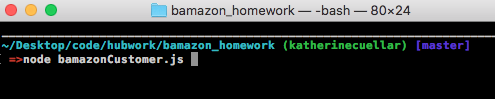
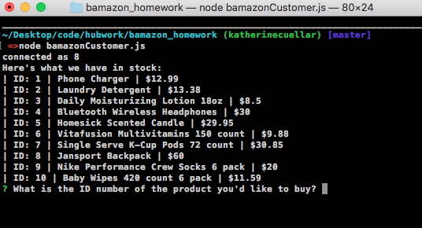
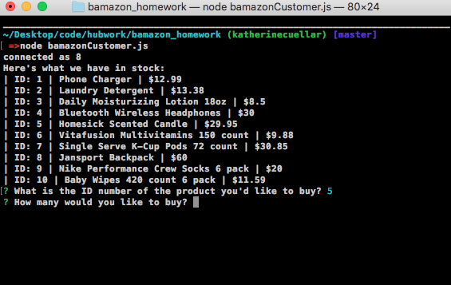
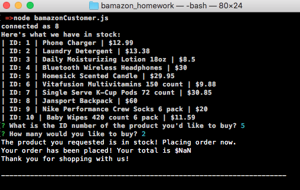
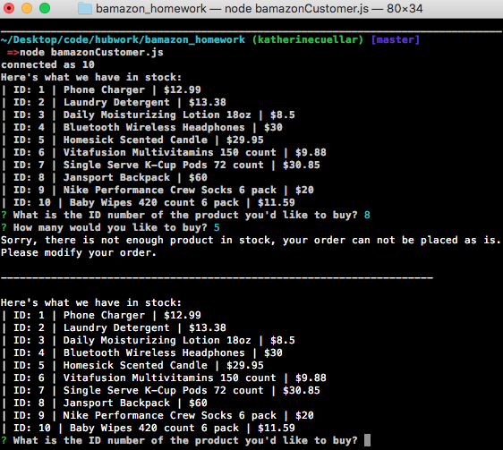

# Bamazon App

* This command line node application simulates online inventory tracking for an application like Amazon (on a much smaller scale).

* Run the command _node bamazonCustomer.js_ 

* The application will populate a list of inventory and prompt you with a question _"What do you want to buy?"_

* When you answer which item you'd like to buy, it asks you for the quantity that you'd like to buy.

* The application will make sure that the system has the item in stock. If it does, it will place the order and let you know your total.
   - _The one thing I could not get to work in this app was for it to properly calculate the total price of all the items._

* If the quantity in stock is less than the quantity requested, the app will alert that there is not enough product in stock, ask the user to adjust their order, and will re-list the inventory.

